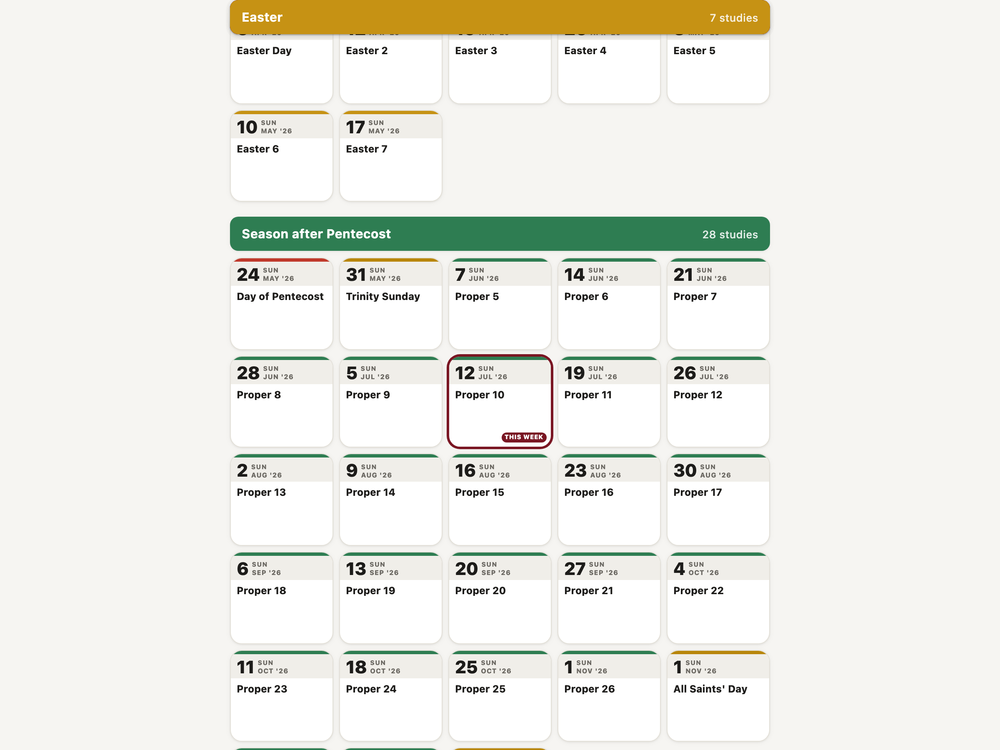
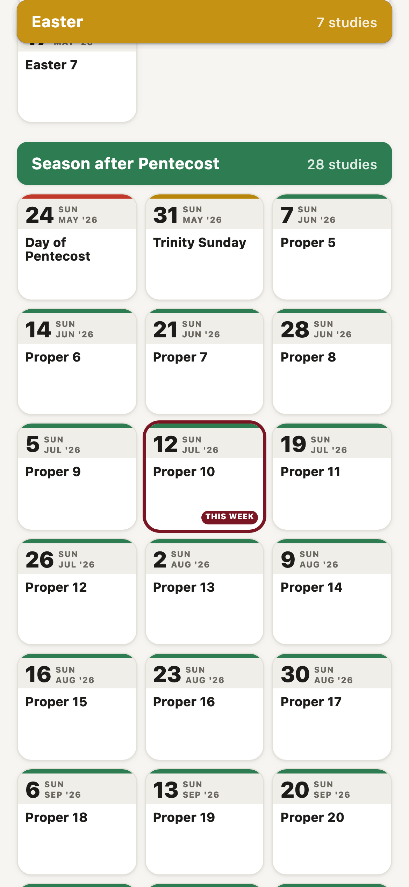
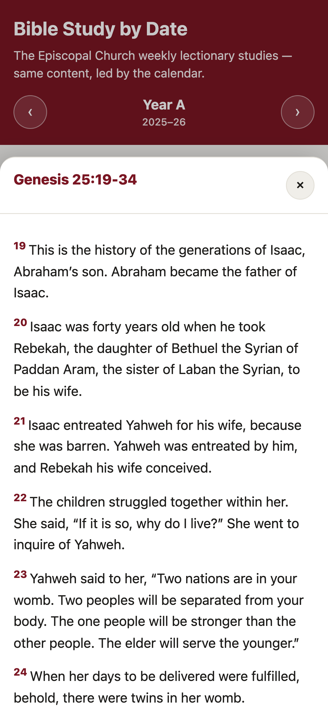
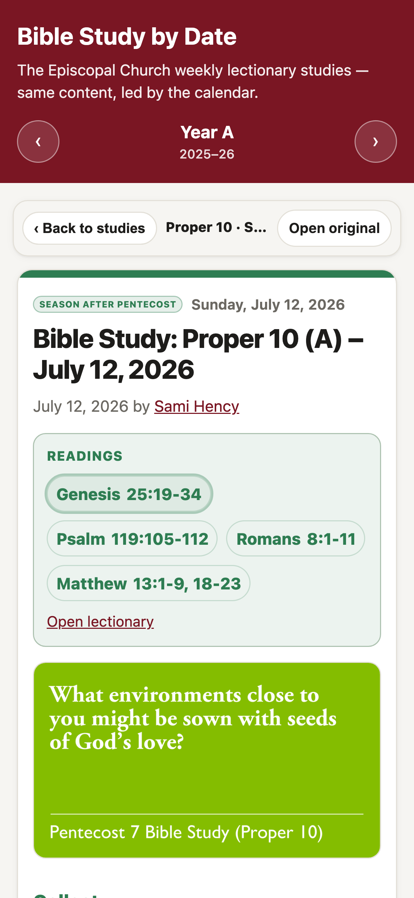

# Bible Study by Date

A mobile-first reader for the [Episcopal Church's weekly lectionary Bible studies](https://www.episcopalchurch.org/bible-study/), organized by the church calendar.

**Live:** https://bible-study-weld.vercel.app

The official studies are excellent, but finding the right week and reading it comfortably on a phone is harder than it should be. This app fixes that: it works out where you are in the liturgical year, puts this week's study at the top, pulls the content live, and lets you tap any scripture reference to read the passage without leaving the page.



## Why it's built this way

- **Organized by the church calendar, not a website menu.** The app computes the current liturgical season and week in the browser and highlights this week's study. Studies are grouped by season — Advent, Christmas, Epiphany, Lent, Easter, Season after Pentecost — using the traditional liturgical colors as orientation cues.

- **Built for a phone.** The layout is a narrow, scannable column that reads well at a table. It respects safe-area insets and follows the system light/dark preference automatically.

  

- **Reads the scripture for you, in place.** The app scans both the lectionary readings and the study text for scripture references (e.g. `Matthew 13:1-9, 18-23`) and turns each into a tappable link. Tapping one slides the passage text up in a panel, so there's no leaving the app to look something up mid-discussion.

  

- **Content comes straight from the source, live.** Rather than copying and pasting studies (which go stale and aren't ours to reproduce), a small serverless endpoint fetches each study from `episcopalchurch.org` on demand, strips the site chrome, and returns clean structured JSON. Author attribution, the lectionary readings, and a link back to the original are always preserved.

  

- **A library of the Apocrypha.** Alongside the weekly studies, the app carries twenty-five apocryphal texts in public-domain translations — the fourteen deuterocanonical books, the pseudepigrapha (1 and 2 Enoch, Jubilees, the Life of Adam and Eve, the Testament of Solomon), and the New Testament apocrypha (the gospels of Thomas, Mary, Philip, Judas and James, and the Acts of Paul and Thecla) — each with a scholarly essay on its origins, manuscripts, and canonical status. The texts come live from the [apoc](https://github.com/sirkitree/apoc) collection.

- **Deliberately simple.** No build step, no client framework — a single static `index.html` plus three small serverless functions. That keeps it cheap to run and easy to maintain.

## How it works

| Piece | Role |
| --- | --- |
| `index.html` | The whole client: liturgical-calendar math, season grouping, article rendering, and the scripture lookup UI, in vanilla JS and CSS custom properties. No build step. |
| `api/study.js` | Fetches a study page from `episcopalchurch.org`, parses the article with [cheerio](https://cheerio.js.org/), and returns sanitized structured JSON. Falls back to discovering the detail URL from the season hub page when a dated URL isn't published yet. |
| `api/passage.js` | Looks up scripture text via [bible-api.com](https://bible-api.com/) (World English Bible, public domain) for the tap-to-read panel. Verifies that the book returned is the book asked for, since the upstream resolves unknown names to the nearest match instead of erroring. |
| `api/apoc.js` | Serves the Library from the [apoc](https://github.com/sirkitree/apoc) corpus at a pinned commit, parsing each book's markdown into chapters and verses, and each book's README into a typed essay. |
| `server.js` | A tiny Node HTTP server that serves the static file and routes `/api/*` to the handlers, so the Vercel functions can be run locally without Vercel. |

Each handler allowlists exactly one upstream host as a constant in its own file — `www.episcopalchurch.org` for studies, `raw.githubusercontent.com` (pinned to a single commit of one repository) for the Library, bible-api.com for verse lookups — and parsed content is returned as typed JSON blocks rather than raw HTML. The Library client sends only a book id from a server-side allowlist, never a path or URL. See [`design.md`](design.md) for the full design notes.

## Run locally

Requires Node 18+ (for built-in `fetch`).

```bash
npm install
npm run dev        # serves at http://localhost:4173
```

`npm run check` runs a syntax check across the server and API files.

## Deploy

The app is configured for [Vercel](https://vercel.com) via `vercel.json`: `index.html` is served as a static asset and `api/*.js` run as serverless functions. Any host that can serve a static file alongside two Node serverless functions will work.

```bash
vercel        # preview
vercel --prod # production
```

## Attribution & content

The Bible studies are written and published by [The Episcopal Church](https://www.episcopalchurch.org/bible-study/) and remain their work — this app only reformats and links to them, and preserves author and source links throughout. Scripture text shown in the lookup panel is the World English Bible (public domain) via bible-api.com. The Library's texts and essays come from the [apoc](https://github.com/sirkitree/apoc) collection: the translations are public domain (King James with Apocrypha, Douay-Rheims, and the World English Bible), and every reading and essay view names its edition and links the exact source file.

The application code in this repository is released under the [MIT License](LICENSE).
